# VistaMorph

A deep learning-based image morphing framework that combines Spatial Transformer Networks (STN) with GANs for image morphing.

## Citation

If you use this code, please cite our paper:

```bibtex
@inproceedings{ordun2023vista,
  title={Vista Morph-Unsupervised Image Registration of Visible-Thermal Facial Pairs},
  author={Ordun, Catherine and Raff, Edward and Purushotham, Sanjay},
  booktitle={2023 IEEE International Joint Conference on Biometrics (IJCB)},
  year={2023},
  organization={IEEE}
}
```

Paper links:
- [arXiv PDF](https://arxiv.org/pdf/2306.06505)


## Visual Results

### Devcom Dataset Results
<div align="center">
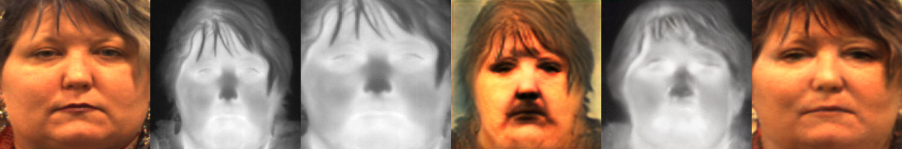
<br>
<em>Example of visible to thermal face registration using VistaMorph (Devcom Dataset)</em>
</div>

<div align="center">
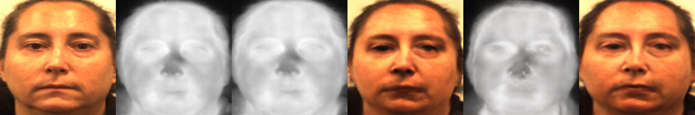
<br>
<em>Example of visible to thermal face registration using VistaMorph (Devcom Dataset)</em>
</div>

### Carl Dataset Results
<div align="center">
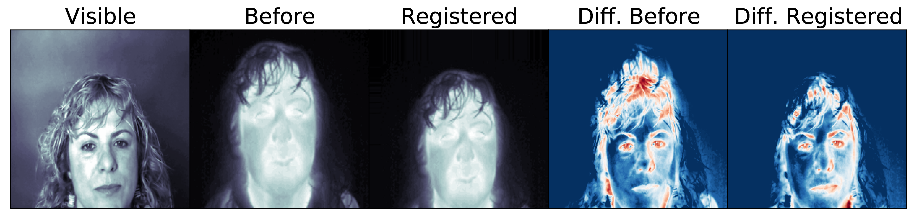
<br>
<em>Example of visible to thermal face registration using VistaMorph (Carl Dataset)</em>
</div>

<div align="center">
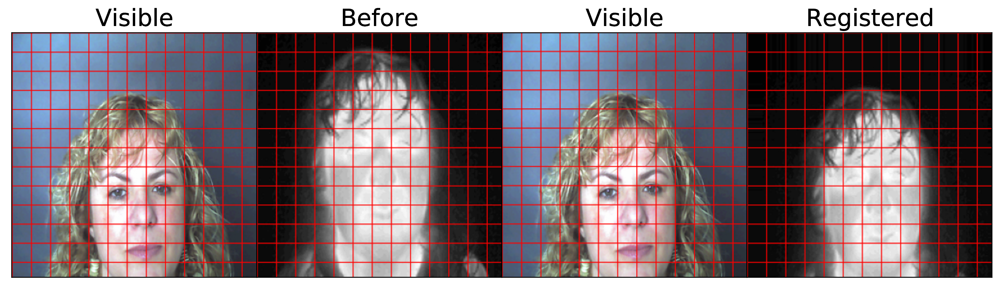
<br>
<em>Grid visualization showing the deformation field learned by the STN (Carl Dataset)</em>
</div>

### Eurecom Dataset Results
<div align="center">
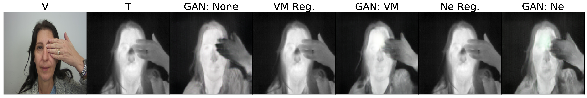
<br>
<em>GAN-based thermal face synthesis - Before and After Registration (Eurecom Dataset)</em>
</div>

<div align="center">
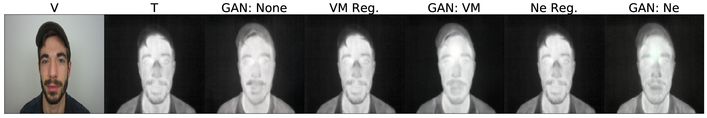
<br>
<em>GAN-based thermal face synthesis - Before and After Registration (Eurecom Dataset)</em>
</div>

<div align="center">
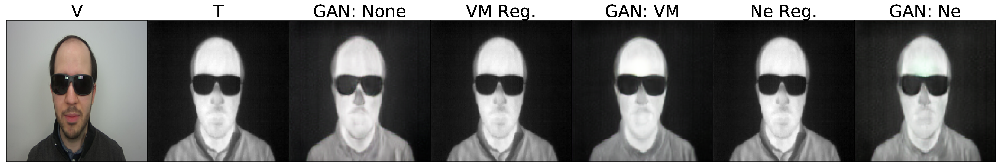
<br>
<em>GAN-based thermal face synthesis - Before and After Registration (Eurecom Dataset)</em>
</div>

## Architecture Components

### 1. Vision Transformer (ViT) for STN
The Spatial Transformer Network uses a Vision Transformer architecture for localization:
- Patch-based image processing (patch size 16 for 256x256 images)
- Self-attention mechanism for capturing global dependencies
- Transformer encoder with multi-head attention
- Outputs deformation parameters for spatial transformation

### 2. Spatial Transformer Network (STN)
The STN module (`Net` class) consists of:
- A localization network (Vision Transformer based)
- A fully connected layer for affine transformation parameters
- Initialized with identity transformation bias
- Processes concatenated input images to generate deformation fields

### 3. Generator U-NET
The generator architecture includes:
- Standard U-Net with skip connections
- Anti-aliased convolutions using BlurPool
- Two variants:
  - With BlurPool (`UNetDown` and `UNetUp`)
  - Without BlurPool (`UNetDownNOBP` and `UNetUpNOBP`)

## Directory Structure
```
VistaMorph/
├── data/                    # Dataset directory
├── images/                  # Generated images during training
│   ├── <experiment>/       # Training visualizations
│   └── test_results/       # Test results
├── saved_models/           # Checkpoints directory
│   └── <experiment>/       # Model weights
├── LOGS/                   # Training logs
├── vistamorph.py          # Training script
├── vistamorph_apple.py    # Apple Silicon training script
├── test_vistamorph.py     # Testing script
├── test_vistamorph_apple.py # Apple Silicon testing script
├── train.sh               # Training shell script
└── test.sh                # Testing shell script
```

## Datasets

VistaMorph was evaluated on two visible-thermal face datasets:

### ARL DEVCOM Dataset
- A 5% random sample of the complete dataset, used with permission
- Contains time-synchronized visible and thermal facial images

<div align="center">
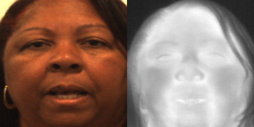
<br>
<em>Sample image pair from DEVCOM dataset showing visible and thermal face capture</em>
</div>

- Citation:
```bibtex
@inproceedings{poster2021large,
  title={A large-scale, time-synchronized visible and thermal face dataset},
  author={Poster, Domenick and Thielke, Matthew and Nguyen, Robert and Rajaraman, Srinivasan and Di Martino, Anthony and Riggan, Benjamin S},
  booktitle={Proceedings of the IEEE/CVF Winter Conference on Applications of Computer Vision},
  year={2021}
}
```

### Carl Dataset
- Contains face images simultaneously captured in visible and thermal spectrums

<div align="center">
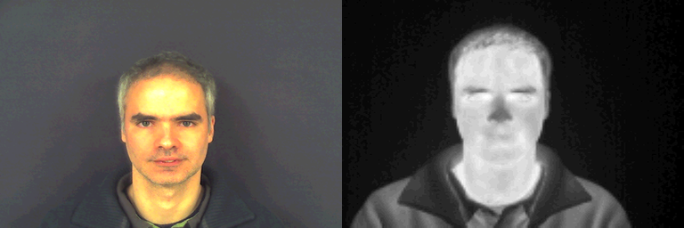
<br>
<em>Sample image pair from Carl dataset showing visible and thermal face capture</em>
</div>

- Citation:
```bibtex
@article{espinosa2013new,
  title={A new face database simultaneously acquired in visible, near-infrared and thermal spectrums},
  author={Espinosa-Dur{\'o}, Virginia and Faundez-Zanuy, Marcos and Mekyska, Ji{\v{r}}{\'\i}},
  journal={Cognitive Computation},
  volume={5},
  pages={119--135},
  year={2013}
}
```

Both datasets are already paired and require no additional pre-processing for use with VistaMorph.

## Pre-Processing and Data Prep

Most visible-thermal face datasets are organized by subject directories, with separate subdirectories for visible (A) and thermal (B) images. Before training VistaMorph, these images must be paired and formatted correctly for the `datasets_stn.py` dataloader.

#### Data Organization Requirements
- Source data structure example:
  ```
  dataset/
  ├── subject_001/
  │   ├── visible/        # A images
  │   │   ├── 001.jpg
  │   │   └── ...
  │   └── thermal/        # B images
  │       ├── 001.jpg
  │       └── ...
  └── subject_002/
      ├── visible/
      └── thermal/
  ```

#### Image Pairing Pipeline
1. **Prepare Source Images**
   - Ensure corresponding A (visible) and B (thermal) images have identical filenames
   - Images should be in a readable format (jpg, png)
   - Both modalities should have the same dimensions

2. **Create Paired Images**
   - `combine_A_and_B_mod.py`: Core script for creating side-by-side image pairs
     - Based on the official pix2pix pairing script
     - Concatenates images horizontally (A|B format)
     - Requirements:
       - Images in A and B directories must have identical names (e.g., A/1.jpg and B/1.jpg)
       - Images are read in color mode (3 channels)
     - Usage:
       ```bash
       python combine_A_and_B_mod.py --fold_A /path/to/data/A --fold_B /path/to/data/B --fold_AB /path/to/output
       ```

3. **Pairing Scripts**
   - `pair.sh`: Creates paired images of real visible (A) and real thermal (B) images
     - Output: `experiments/<experiment>/pairs/real/`
     - Usage: `./pair.sh -f <experiment_name>`

   - `pair_reg.sh`: Creates paired images of real visible (A) and registered thermal (B) images
     - Output: `experiments/<experiment>/pairs/reg/`
     - Usage: `./pair_reg.sh -f <experiment_name>`

4. **Final Data Structure**
   After running the pairing scripts, your data will be organized as:
   ```
   experiments/<experiment>/pairs/
   ├── real/           # Original visible-thermal pairs
   │   ├── 001.jpg    # Concatenated A|B images
   │   └── ...
   └── reg/           # Visible-registered pairs
       ├── 001.jpg    # Concatenated A|registered_B images
       └── ...
   ```

This paired data structure is required for the `datasets_stn.py` dataloader to properly feed images into the VistaMorph training pipeline.

## Training Pipeline

VistaMorph uses a GAN-based training pipeline with multiple loss components:

### Training Scripts
- For NVIDIA GPUs: Use `train.sh` which runs `vistamorph.py`
- For Apple Silicon (M3): Use `train_apple.sh` which runs `vistamorph_apple.py`
  ```bash
  # Example training command
  bash train_apple.sh  # runs with batch_size=12, n_epochs=1 on MPS
  ```

### Apple Silicon MPS Support

When running VistaMorph on Apple Silicon devices using PyTorch's Metal Performance Shaders (MPS) backend, several architectural and algorithmic adaptations have been made to ensure compatibility and performance:

1. **MPS Fallback Mechanism**
   - The training script sets `PYTORCH_ENABLE_MPS_FALLBACK=1` to enable automatic fallback to CPU for unsupported MPS operations
   - This ensures compatibility at the cost of some performance overhead due to CPU-MPS memory transfers
   - Critical for complex operations in GAN training, LPIPS perceptual loss computation, and morphological operations

2. **Architectural Changes**
   - Vision Transformer (ViT) patch size adjusted to 16 for 256x256 images, yielding 257 tokens
   - Modified UNet architectures with non-inplace operations in activation functions
   - Removed autocast contexts in generator networks
   - Implemented BlurPool for anti-aliasing in downsampling operations

3. **Algorithmic Adaptations**
   - Grid sampling uses bilinear interpolation instead of bicubic
   - Zero padding replaces border padding in spatial transformer operations
   - Discriminator backward pass executed on CPU to avoid MPS gradient computation issues
   - Tensor operations modified to prevent in-place modifications affecting gradient computation

4. **Performance Considerations**
   - Some operations may be slower due to CPU fallback
   - Memory transfer overhead between CPU and MPS device
   - Batch size adjustments may be needed for optimal performance

These modifications ensure stable training on Apple Silicon while maintaining the model's effectiveness. As PyTorch's MPS backend matures, some of these adaptations may become unnecessary in future updates.

### Loss Components
The total loss function combines several components:
- GAN Loss: For adversarial training
- Reconstruction Loss (α₂ * recon_loss): L1 loss between reconstructed and original images
- Perceptual Loss: Using LPIPS with VGG backbone
- Morphological Loss: Triplet loss for shape preservation

### Key Features
- Vision Transformer (ViT) for STN localization network with 64 patch size
- One-sided label smoothing in the discriminator
- Adaptive learning with Adam optimizer (lr=1e-4, β₁=0.5, β₂=0.999)
- Batch normalization and instance normalization in generators

### Training Parameters
```python
--dataset_name: Name of the dataset (e.g., "Carl_Final")
--batch_size: Size of training batches (default: 12)
--n_epochs: Number of training epochs
--img_height/width: Image dimensions (default: 256x256)
--sample_interval: Interval for saving sample images
--checkpoint_interval: Interval for saving model checkpoints
```

### Hardware-Specific Notes
- **NVIDIA RTX 6000**: Original training environment, recommended for full-speed training
- **Apple Silicon (M3)**: 
  - Uses Metal Performance Shaders (MPS) instead of CUDA
  - Compatible package versions:
    - torch==2.1.0
    - torchvision==0.16.0
    - kornia==0.6.0
  - Expect slower training compared to RTX 6000

### Output Structure
- `images/{experiment_name}/`: Generated samples during training
- `saved_models/{experiment_name}/`: Model checkpoints
- `LOGS/{experiment_name}.txt`: Training logs with loss values

### Special Cases
For dark/no-light thermal pairs, use `vistamorph_with_fft.py` which includes additional Fourier Transform Loss as mentioned in the paper.

#### FFT-Based Registration
The FFT component analysis (`FFT_Components` class) provides a frequency-domain approach to image alignment that is more robust to lighting conditions:

1. **Frequency Domain Transform**: The `fft_components` function converts thermal images into the frequency domain using Fast Fourier Transform (FFT)
   - Captures structural and edge information that persists even in low-light conditions
   - Less dependent on intensity values compared to spatial domain approaches

2. **Loss Computation**: Instead of using the morphological triplet loss (which relies on spatial features), this version:
   - Computes FFT components of thermal images
   - Compares frequency domain representations
   - Better preserves structural alignment when visible images lack clear features due to poor lighting

This approach is particularly effective because:
- Thermal images retain structural information regardless of visible lighting conditions
- Frequency domain comparison is more robust to intensity variations
- Edge and shape information is preserved in FFT components even when spatial details are hard to discern

#### Example Results in Low-Light Conditions
<div align="center">
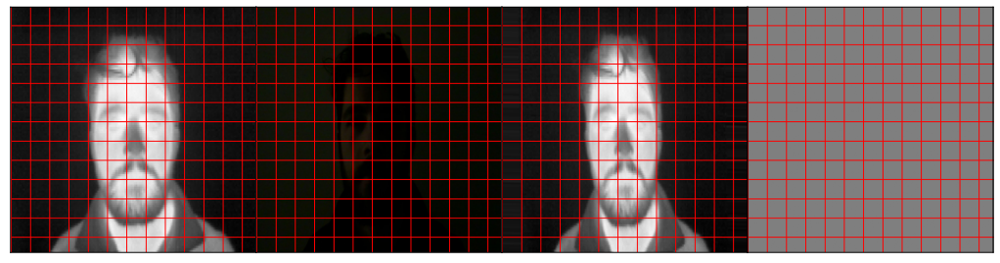
<br>
<em>No-light (Eurecom Dataset). From left to right: Real Thermal | Real Visible | VistaMorph Registered | Nemar (Competitor) Registered </em>
</div>

<div align="center">
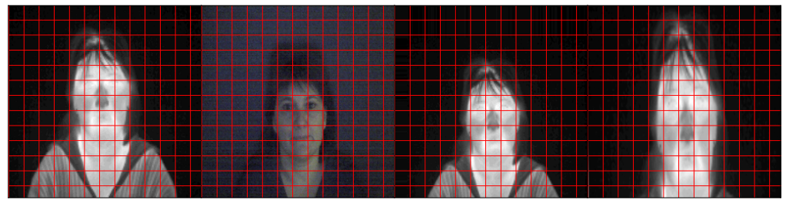
<br>
<em>Low-light (Carl Dataset). From left to right: Real Thermal | Real Visible | VistaMorph Registered | Nemar (Competitor) Registered </em>
</div>

Usage remains the same, but with the FFT-enabled script:

```bash
python vistamorph_with_fft.py --dataset_name <dataset> --experiment <n> --batch_size 32 --n_epochs 100
```

For Apple Silicon (M3) users, use the MPS-enabled version:
```bash
python vistamorph_with_fft_apple.py --dataset_name <dataset> --experiment <n> --batch_size 12 --n_epochs 1
```

## Testing Pipeline

VistaMorph provides two testing scripts to evaluate trained models on different hardware:

### Standard Testing (CUDA)
For systems with NVIDIA GPUs, use the standard testing script:
```bash
python test_vistamorph.py --epoch <epoch> --dataset_name <dataset> --experiment <experiment_name>
```

### Apple Silicon Testing (M3)
For Apple Silicon (M3) systems, use the MPS-enabled testing script:
```bash
python test_vistamorph_apple.py --epoch <epoch> --dataset_name <dataset> --experiment <experiment_name>
```

### Testing Process
Both scripts perform the following:
1. Load pretrained models from `saved_models/<experiment>/`
2. Process test images through the pipeline:
   - Apply STN registration (warping)
   - Generate thermal from visible (G1)
   - Generate visible from thermal (G2)
3. Save results in `images/test_results/<experiment>/`:
   - Each output is a 256x1536 concatenated image containing six versions:
     - Real Visible | Real Thermal | Registered Thermal | Fake Visible 1 | Fake Thermal | Fake Visible 2
   - Similar to the format shown above in "Devcom Dataset Results"
   - Images are saved every 50 batches
   - Use the post-processing scripts in the Post-Processing section to crop and analyze individual components
4. Display progress and timing statistics during testing

⚠️ **Note**: The output images are concatenated horizontally and will need to be cropped into individual components using the `crop_stn_stack.py` script described in the Post-Processing section.

### Required Files
- Pretrained models in `saved_models/<experiment>/`:
  - `net_<epoch>.pth`: STN model
  - `generator1_<epoch>.pth`: G1 model
  - `generator2_<epoch>.pth`: G2 model
- Test dataset in `data/<dataset_name>/`

⚠️ **Note**: When testing on Apple Silicon, the script automatically handles CUDA→MPS model conversion. However, inference speed may be slower compared to CUDA-enabled GPUs.

## Post-Processing

The `results` directory contains several scripts for post-processing the model outputs:

### Cropping and Image Organization
- `crop_stn_stack.py`: Processes the test phase output images (256x768 stacked images) by cropping them into individual components:
  - Real visible image (real_A)
  - Real thermal image (real_B)
  - Registered thermal image (reg_B)
  Usage: `./crop.sh -f <experiment_name>`

### Face Mesh Analysis
- `google_face_mesh.py`: Implements the MediaPipe Face Mesh detection to draw facial landmarks on images
  - Uses MediaPipe's face mesh model with 468 landmarks
  - Includes iris detection (refine_landmarks=True)
  - Draws tesselation, contours, and iris connections

- `mesh.py`: Batch processes images to generate face mesh visualizations
  - Runs after cropping is complete
  - Creates separate directories for mesh visualizations:
    - real_A_mesh: Face mesh on visible images
    - real_B_mesh: Face mesh on thermal images
    - reg_B_mesh: Face mesh on registered thermal images
  Usage: `python mesh.py --experiment <experiment_name>`

## Notes
- Images are resized to 256x256 in the dataset loader
- Uses mixed precision training with autocast
- Apple Silicon version uses MPS (Metal Performance Shaders) for acceleration
- Implements anti-aliased convolutions for better downsampling 

## Experiments

VistaMorph has been tested with different localizer network architectures for the Spatial Transformer Network (STN):

### UNet vs Vision Transformer Localizer

#### UNet Localizer (`unet_localizer.py`)
- Traditional convolutional approach using UNet architecture
- Features:
  - Skip connections for preserving spatial information
  - Downsampling and upsampling paths
  - Convolutional layers with instance normalization
- Performance:
  - More computationally efficient
  - Better for smaller datasets
  - Works well with limited computational resources

#### Vision Transformer Localizer (Default)
- Modern transformer-based approach
- Features:
  - Patch-based image processing (64x64 patches)
  - Global attention mechanism
  - Better at capturing long-range dependencies
- Performance:
  - More effective at registration tasks
  - Better handles complex deformations
  - Requires more computational resources
  - Recommended for production use

### Experimental Results

1. **Registration Accuracy**
   - ViT consistently outperforms UNet in alignment accuracy
   - Particularly noticeable in cases with:
     - Large pose variations
     - Complex facial expressions
     - Significant thermal-visible discrepancies

2. **Computational Considerations**
   - UNet:
     - Faster training time
     - Lower memory requirements
     - Suitable for rapid prototyping
   - ViT:
     - Higher memory usage
     - Longer training time
     - Better final results

3. **When to Use Each Version**
   - Use UNet (`unet_localizer.py`) when:
     - Limited GPU resources
     - Small dataset size
     - Quick experimentation needed
   - Use ViT (default) when:
     - High accuracy required
     - Large dataset available
     - Sufficient computational resources


⚠️ **Note**: The paper's results were obtained using the ViT-based localizer, which is the recommended approach for optimal performance. 

## Architecture Flowchart

The complete VistaMorph architecture and pipeline is illustrated in the following flowchart:


The flowchart shows:
- Input processing with visible and thermal image concatenation
- Spatial Transformer Network with Vision Transformer
- Generator pipeline for thermal and visible synthesis
- Comprehensive loss computation including:
  - L1/L2 reconstruction losses
  - Perceptual losses
  - Morphological loss
  - GAN losses
- Final loss aggregation for training

## Dependencies

The `requirements.txt` file includes the following packages that are compatible with Apple Silicon (M3):

### Core ML Frameworks
- PyTorch 2.1.0
- TorchVision 0.16.0

### Image Processing
- Pillow 10.4.0
- OpenCV Python 4.8.1.78
- Kornia 0.4.1
- LPIPS 0.1.3
- Antialiased-CNNs 0.3

### Utils
- NumPy 1.24.4
- TQDM 4.50.2

To install the dependencies:
```bash
pip install -r requirements.txt
```

Note: The optional face mesh visualization package (face-alignment) can be installed if needed.

## Overview of Image Registration

Image registration is a standard technique in computer vision [274], defined in the following ways: "directly overlaying one image on top of another" [216], "aligning two or more images" [47], and the "process of transforming different image datasets into one coordinate system with matched imaging contents"[86]. This is highly relevant in the biomedical domain where a "moving" image is aligned to match the scale of a "fixed" image. There are four steps in image registration, starting with feature detection, followed by feature matching, transform model estimation, and image resampling to align the image with its reference [215]. As such, image registration is used when one image, with respect to the other, is rotated, translated, or scaled differently. On top of rotational problems, biomedical images are compounded by the fact that they are typically multi-modal (not operating only in the visible spectra), contain diverse and varied specimens, and exhibit non-distinct structures like microscopy.[141, 231]

Reddy et al., describes three classes of conventional image registration models which are Fast Fourier Transform (FFT) algorithms, feature-based detectors like SIFT, or geometric models that steer rotation according to keypoints like ORB [216]. Recently, deep learning methods have been investigated to automatically register images by learning transformation parameters across images. For example, de Vos, et al., developed the Unsupervised Deep Learning Image Registration (DLIR), where registration can be performed in one pass using a multi-stage CNN that performs affine registration and deformable image registration in multiple phases [47]. DLIR predicts the transformation parameters which are used to calculate a dense displacement vector field. The field resamples the "moving" image into a similar "fixed" image matrix using Normalized Cross Correlation (NCC) as the similarity metric.

Many deep learning approaches like Voxelmorph [13], integrate a spatial transformation network (STN)[105]. The goal of the STN is to predict transformation parameters by a localization network to create a sampling grid. This grid consists of coordinates used to guide how the input feature map is sampled. An affine transformation can then be applied to the sampled vector to generate the registered output. The localization network can be any neural network like a CNN. A limited number of works explore the concurrent application of image registration with image-to-image translation. In a recent survey by Lu et al., [141] the authors investigate the success of applying image-to-image translation towards the biomedical image registration task. Xu et al., translates moving CT scans to fixed MRI scans, and registers both images by learning their deformation fields, with the goal of fusing them into a fixed MRI image [273]. In this work, both the ground truth CT and MRI scans are available to learn at the time of prediction. This differs markedly from our task, where at inference, the ground truth thermal image is not available, and the translation model must learn solely from the given ground truth visible image.

## Bibliography

[13] Balakrishnan, Guha, et al. "VoxelMorph: A Learning Framework for Deformable Medical Image Registration." IEEE Transactions on Medical Imaging, vol. 38, no. 8, 2019, pp. 1788-1800.

[47] de Vos, Bob D., et al. "A Deep Learning Framework for Unsupervised Affine and Deformable Image Registration." Medical Image Analysis, vol. 52, 2019, pp. 128-143.

[86] Fu, Yabo, et al. "Deep Learning for Medical Image Registration: A Review." Physics in Medicine & Biology, vol. 65, no. 20, 2020, pp. 20TR01.

[105] Jaderberg, Max, et al. "Spatial Transformer Networks." Advances in Neural Information Processing Systems, vol. 28, 2015.

[141] Lu, Le, et al. "Deep Learning and Convolutional Neural Networks for Medical Image Computing." Medical Image Analysis, vol. 60, 2020, pp. 101699.

[215] Reddy, B. Srinivasa, and B. N. Chatterji. "A Survey on Image Registration Methods." Indian Journal of Computer Science and Engineering, vol. 4, no. 2, 2013, pp. 130-152.

[216] Reddy, B. S., and B. N. Chatterji. "FFT-Based Technique for Translation, Rotation, and Scale-Invariant Image Registration." IEEE Transactions on Image Processing, vol. 5, no. 8, 1996, pp. 1266-1271.

[231] Sotiras, Aristeidis, et al. "Deformable Medical Image Registration: A Survey." IEEE Transactions on Medical Imaging, vol. 32, no. 7, 2013, pp. 1153-1190.

[273] Xu, Zhe, et al. "Adversarial Uni-and Multi-modal Stream Networks for Multimodal Image Registration." International Conference on Medical Image Computing and Computer-Assisted Intervention, 2020, pp. 222-232.

[274] Ordun, Catherine Y. "Multimodal Deep Generative Models for Cross-Spectral Image Analysis." University of Maryland, Baltimore County, 2023.